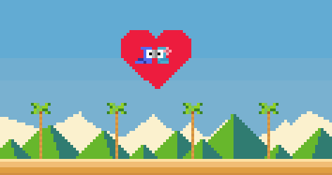

<body>

<a href= "https://github.com/becadev/Jogo-Rio/blob/main/READme.md"> Português</a> | <a href= "https://github.com/becadev/Jogo-Rio/blob/main/READme.en.md"> English</a>

<h1 align = "center">Aventura Carioca</h1>
    

        
    

<strong>Projeto desenvolvido como parte da disciplina de Arquitetura de Computadores</strong>, utilizando <strong>Assembly</strong> para o processador <strong>MIPS</strong>. Inspirado no filme Rio, o jogo apresenta três fases baseadas em clássicos dos videogames: a primeira baseada em <strong>Pac-Man</strong>, a segunda em <strong>Street Fighter</strong> e a terceira em <strong>Flappy Bird</strong>, oferecendo desafios variados e dinâmicos.

    
O objetivo do jogo é ajudar <strong>Blue</strong>, a arara-azul, a superar todos os desafios para finalmente reencontrar sua amada <strong>Jade</strong>.

<h2>Pré-requisitos</h2>
    <ul>
        <li>Certifique-se de que sua máquina possui a versão mais recente do Java.</li>
        <li>Instale o simulador MIPS MARS 4.5: <a href="https://drive.google.com/file/d/1na6RNWXEOFsi82-5QrT-2UvlXCWKMPPT/view?hl=pt-BR">Baixar aqui</a></li>
        <li>Realize o upload do arquivo <strong>Main.asm</strong> no MARS.</li>
    </ul>
    
    
   <h2>Como testar</h2>
    <ol>
        <li>Abra o arquivo <strong>Main.asm</strong> no simulador MARS.</li>
        
<strong>OBS:</strong> O funcionamento da velocidade do jogo é alterada de computador para computador, caso no seu computador as fases estejam funcionando em uma velocidade acima do desejado, realize os seguintes passos para alterar o timer do jogador e NPCs:          
 
            <ul>
                <li>Pressione a tecla <strong>Ctrl + F</strong></li>
                <li>No campo <strong>"Find What"</strong> digite os seguintes rótulos e os alterem de acordo com a velocidade de dados do seu computador(se for alto, maior será o timer, se for lento, menor será)
                    <ul>
                        <li> timerf1: 8000 (valor recomendável)</li>
                        <li> timerf2: 8000 (valor recomendável)</li>
                        <li> timerf3: 8000 (valor recomendável)</li>
                    </ul>
                </li>
            </ul>
        <li>Pressione a tecla <strong>F3</strong> para montar o código.</li>
        <li>No menu <strong>Tools</strong>, selecione:
            <ul>
                <li>"Bitmap Display"</li>
                <li>"Keyboard and Display MMIO Simulator"</li>
            </ul>
        </li>
        <li>Configure o <strong>Bitmap Display</strong> com as seguintes opções:
            <ul>
                <li><strong>Tamanho:</strong> 512 x 256</li>
                <li><strong>Dimensão do pixel:</strong> 4x4</li>
            </ul>
        </li>
        <li>Clique em <strong>"Connect to MIPS"</strong> em ambas as ferramentas.</li>
        <li>Pressione <strong>F5</strong> ou clique no botão de execução ▶️.</li>
        <li>Selecione o <strong>Keyboard</strong> para inserir os comandos do jogo.</li>
    </ol>
    
  <h2>Como jogar</h2>
    
  <h3>1ª Fase: Pac-Man Tropical</h3>
    
<strong>Objetivo:</strong> Blue deve comer todas as frutas sem colidir com as paredes cinzas. Após coletar todas as frutas, o jogador deve se dirigir à saída para avançar de fase.

    
<strong>Teclas de movimento:</strong>

    <pre>W - Cima
A - Esquerda
S - Baixo
D - Direita</pre>
    
   <h3>2ª Fase: Fuga do Nigel</h3>
    
<strong>Objetivo:</strong> Blue precisa desviar dos açaís lançados pela cacatua Nigel. Se conseguir passar sem encostar no bico do Nigel e dando um pulo em cima da crista dele, avança para a próxima fase.

    
<strong>Teclas de movimento:</strong>

    <pre>W - Pular
A - Andar para trás
D - Andar para frente</pre>
    
  <h3>3ª Fase: Voo Final</h3>
    
<strong>Objetivo:</strong> Blue deve atravessar os obstáculos voando entre as árvores sem colidir. Se ultrapassar todos os obstáculos, o jogador vence o jogo.

    
<strong>Tecla de movimento:</strong>

    <pre>W - Voar</pre>
<h2>Desenvolvedores</h2>
<a  href = "https://github.com/emanuellykarine">@emanuellykarine</a>: Integração de fases, Tela inicial e fase final 
<a  href = "https://github.com/josephyaraujo">@josephyaraujo</a>: 2ª Fase 
<a href = "https://github.com/becadev">@becadev</a>: 1ª Fase 

</body>
</html>
